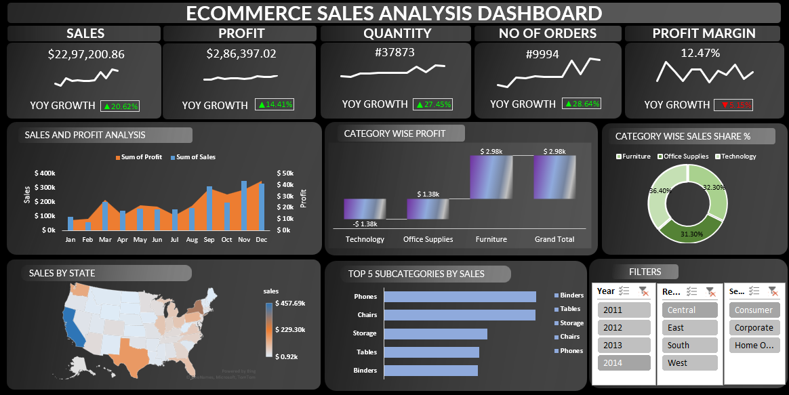

📊 Ecommerce Sales Analysis Dashboard (Excel Project)
## 📌 Project Overview

The Ecommerce Sales Analysis Dashboard is an interactive Microsoft Excel dashboard developed to analyze and visualize e-commerce business performance. It provides comprehensive insights into sales, profit, order quantity, profit margins, category performance and geographical sales distribution through dynamic visualizations.

The dashboard enables business users and decision-makers to monitor key performance indicators (KPIs), identify trends, evaluate product performance and make data-driven decisions.

---

## 🎯 Objectives

* Analyze overall sales and profitability performance.
* Track Year-over-Year (YOY) growth across key business metrics.
* Compare profit generated by different product categories.
* Identify top-performing product sub-categories.
* Analyze sales distribution across different states.
* Monitor monthly sales and profit trends.
* Enable interactive filtering for detailed business analysis.

---

## 🛠 Tools & Features Used

* Microsoft Excel
* Pivot Tables
* Pivot Charts
* Slicers
* Conditional Formatting
* Data Cleaning
* Dashboard Design
* Data Visualization

---

## 📈 Dashboard KPIs

### 1. Total Sales

Displays the total revenue generated from sales.

### 2. Total Profit

Shows the overall profit earned by the business.

### 3. Total Quantity

Represents the total quantity of products sold.

### 4. Number of Orders

Displays the total number of customer orders.

### 5. Profit Margin

Shows the overall profitability percentage of the business.

---

## 📊 Dashboard Visualizations

### 1. Sales and Profit Analysis

Monthly comparison of sales and profit trends.

### 2. Category-wise Profit Analysis

Analyzes profit contribution from:

* Furniture
* Office Supplies
* Technology

### 3. Category-wise Sales Share (%)

Displays the percentage contribution of each category to total sales.

### 4. Sales by State

Geographical visualization showing sales distribution across states.

### 5. Top 5 Sub-Categories by Sales

Highlights the best-performing product sub-categories.

---

## 🎛 Interactive Filters

Users can dynamically filter the dashboard using:

* Year Filter
* Region Filter
* Segment Filter

These slicers update all charts and KPIs instantly.

---

## 📊 Key Insights

* Furniture category generates the highest profit.
* Phones emerged as the top-selling sub-category.
* Sales and profit show positive growth over the years.
* Significant variation exists in sales performance across states.
* Overall profit margin indicates healthy business profitability.

---

## 📷 Dashboard Preview

---

## 🚀 How to Use

1. Download the Excel dashboard file.
2. Open the file in Microsoft Excel.
3. Enable content if prompted.
4. Use the slicers to filter data by Year, Region or Segment.
5. Explore interactive charts and KPI cards.

---

## 📁 Project Structure

Ecommerce-Sales-Analysis-Dashboard/
│
├── Ecommerce_Sales_Analysis_Dashboard.xlsx
├── Dashboard.png
└── README.md
